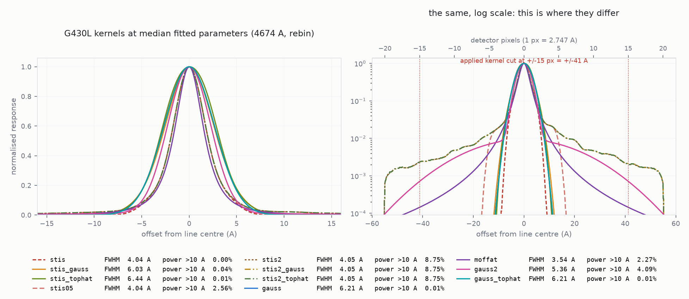

# The NGSL line spread function

Everything this project knows about NGSL's instrument profile. Measured by
[`explore/ngsl_lsf.py`](../explore/ngsl_lsf.py) against XSL, with no stellar
model anywhere in it.

## What to use

```python
from common.lsf import to_ngsl_pixels     # model on grid -> NGSL pixels
from common.lsf import broaden_ngsl       # just the kernel, if you must
```

`broaden_ngsl` is the only NGSL kernel in the project. There is no Gaussian
alternative and no `tabulated=True` switch, because two live broadening paths
is what previously let the fitter and the comparison figures disagree about the
instrument.

| | |
|---|---|
| profile | **Moffat**, β = **1.52 ± 0.16** |
| core FWHM, G430L | **3.54 ± 0.16 Å** (2.747 Å/px) |
| core FWHM, G750L | **8.38 ± 0.45 Å** (4.879 Å/px) |
| behaviour with λ | constant in **Ångströms** within a grating, jumping at the splices |
| sampling | fitted **with pixel integration**; must be applied that way |
| truncation | **±15 detector pixels** — 41 Å (G430L), 73 Å (G750L) |
| power beyond ±10 Å | 2.4% (G430L) — a Gaussian of the same core puts 0.01% there |

Uncertainties are star-to-star NMAD over 9 stars. G230LB is not measured — no
sample star has XSL below 3501 Å — and keeps a 2-pixel placeholder; nothing in
this project uses it.

## How it is measured

XSL observes the same stars at R ≈ 9800, roughly 20× NGSL, so degrading XSL to
NGSL asks a purely instrumental question. The fit is

```
NGSL(λ_n)  ≈  P(λ_n) · S[ XSL ⊗ K(θ) ](λ_n)
```

* **K** — the trial profile, with free widths and a free wavelength shift.
* **S** — the sampling operator: integrate across each NGSL pixel (`rebin`) or
  interpolate at its centre (`interp`). Both are reported.
* **P** — a degree-5 Chebyshev polynomial in λ, solved by linear least squares
  at every kernel trial. The libraries differ by slit losses, aperture
  corrections and flux calibration, all smooth in λ. Because P *multiplies* the
  smoothed XSL spectrum it cannot absorb a line: it is a continuum **ratio**,
  not a continuum normalisation of each spectrum separately.

Scored on the rms percent residual over the whole grating. The Balmer cores are
reported but are **never** a fit target — see [What the cores can and cannot
settle](#what-the-cores-can-and-cannot-settle).

Nine primary-tier stars. No metallicity or grid-reach cut: this measurement
never touches the model grid, so a star being outside the grid's [M/H] range
says nothing about its usefulness as an instrument calibrator.

## The profile comparison

G430L, median over 9 stars, pixel integration:

| profile | npar | rms % | core mean % | core peak % | FWHM Å | power >10 Å |
|---|---|---|---|---|---|---|
| `stis2` 52x2.0, fixed | 0 | 1.958 | −4.74 | −12.92 | 4.05 | 8.75% |
| `stis` 52x0.2, fixed | 0 | 1.886 | +4.74 | +14.11 | 4.04 | 0.00% |
| `gauss` | 1 | 1.085 | +0.67 | +6.34 | 6.21 ± 0.42 | 0.01% |
| `gauss` ⊗ tophat | 2 | 1.085 | +0.67 | +6.34 | 6.21 | 0.01% |
| `stis` ⊗ tophat | 1 | 1.057 | +0.78 | +6.35 | 6.44 ± 0.68 | 0.01% |
| `stis` ⊗ gauss | 1 | 1.047 | +0.65 | +6.09 | 6.03 ± 0.49 | 0.03% |
| **`stis05` 52x0.5, fixed** | **0** | **1.045** | **−0.11** | +5.74 | 4.04 | 2.56% |
| **`moffat`** | **2** | **0.930** | **−0.02** | +5.92 | 3.54 ± 0.16 | 2.44% |
| `gauss` + `gauss` | 3 | 0.908 | +0.08 | +4.94 | 5.33 ± 0.64 | 3.19% |

### The tabulated apertures bracket the answer

The STIS tables give a model LSF for four slit widths. **All four share a core**
— 4.04 Å at G430L's midpoint — and differ only in the wings, because a wide slit
admits scattered light that a narrow one cuts off:

| aperture | G430L core | power >10 Å | power >20 Å |
|---|---|---|---|
| 52x0.1 | 3.82 Å | 0.00% | 0.00% |
| 52x0.2 — **NGSL's slit** | 4.04 Å | 0.00% | 0.00% |
| 52x0.5 | 4.04 Å | **2.56%** | 0.00% |
| 52x2.0 | 4.05 Å | 8.75% | 4.05% |
| *fitted Moffat* | *3.54 Å + tail* | ***2.44%*** | *0.52%* |

So they bracket the question *how much scattered light does NGSL's delivered
profile actually carry?*, and three things fall out:

1. **The core residual changes sign across the bracket** — +4.74% at 52x0.2,
   −4.74% at 52x2.0 — so the answer lies strictly between the two, and neither
   endpoint is it.
2. **52x2.0 is already too broad.** `stis2` ⊗ gauss and `stis2` ⊗ tophat both
   drive their extra broadening to zero and return the fixed profile unchanged.
   Nothing can be added to the 2″ profile; the data want less halo than it has.
3. **The fitted halo is the 52x0.5 halo.** The Moffat's 2.44% beyond ±10 Å and
   the tabulated 52x0.5's 2.56% agree to better than the star-to-star scatter of
   anything else here — and `stis05`, with **zero free parameters**, scores
   rms 1.045% with a core residual of −0.11%, beating every one-parameter
   profile in the table including the free Gaussian.

That last point is the strongest evidence in this document that the halo is real
instrumental scattered light rather than a fitting artefact. `stis05` is an
instrument calibration product — arc lamps and point sources, no A star, no
stellar model, nothing from this project, and not even the right slit — and
adding its wings to the same tabulated core takes the Balmer core residual from
+4.74% to −0.11% without a single adjustable parameter.

What it does not do is beat the Moffat (1.045% against 0.930%), and it carries a
puzzle: NGSL observed through 52x0.2, whose tabulated profile has **no** halo at
all. So the delivered spectra behave like a slit 2.5× wider than the one used.
Co-adding dithered exposures and resampling redistributes flux and is the
obvious suspect, but a box cannot make a heavy tail (see below), so that is a
conjecture and not a result.

**Adopting it was tried and reverted, and here is what it would cost.** The
tabulated profile varies with wavelength within a grating, so applying it needs
a chunked convolution — the kernel rebuilt every ~400 Å — where the Moffat needs
one convolution per grating. Holding a single kernel per grating instead is not
good enough: it changes the smoothed flux by 2.8 × 10⁻³, comparable to effects
this project measures, and chunking at 400 Å is converged (4 × 10⁻⁴ against
chunk = 150 Å). The cost is **21 ms per model evaluation against the Moffat's
8 ms** on a full 3200–10200 Å log grid, which at ~100k evaluations per node scan
is roughly 35 min/star against 13. That is affordable but not free, and it buys
a profile with a 12% worse rms. The Moffat stays.

The argument *for* it, if anyone revisits this: zero fitted parameters, and a
provenance entirely outside this project. A profile that cannot be tuned cannot
be tuned wrong.

**The Moffat is adopted over the marginally better two-Gaussian** because its
second parameter is a *measurement*. Over the nine stars β runs 1.40 to 2.06,
while the two-Gaussian's broad component scatters from 25 Å to 13574 Å — that
profile has three parameters and only two of them mean anything.

**The resampling hypothesis is half right, and the half it gets is the core.**
`stis` ⊗ tophat — the tabulated profile convolved with a free box, which is what
a dither offset and a resampling both are — fits a box of **5.62 ± 0.94 Å =
2.05 ± 0.34 G430L pixels**, and 2.65 px on G750L. One parameter, a mechanism
behind it, and it beats the free Gaussian. What it cannot do is make the tail:
0.01% of its power lands beyond ±10 Å against the ~2.4% the data want, because a
box convolved with anything Gaussian still has Gaussian-fast wings. So
resampling accounts for the core width and scattered light accounts for the
halo.

**A measurement trap, since it cost an hour here.** Do not compute the wing
fraction as `trapz(y[mask], x[mask])` over a two-sided mask of the raw table.
The mask is not contiguous, so the trapezoid rule bridges the gap across the
core and roughly doubles the answer — it gave 11.65% and 18.30% for 52x0.5 and
52x2.0 against the correct 2.56% and 8.75%. `wing_power` sums on the uniform
kernel grid and is right.



On a linear scale every profile looks much the same. The log panel is where they
differ, and it is the whole argument.

## Constant in Ångströms, not in R

Fitting each sub-window separately and regressing width on wavelength as
FWHM ∝ λ^α — α = 0 is constant in Å, α = 1 is constant in R — over four
Balmer-anchored G430L windows, 9 stars each:

| | 3850 Å | 4125 Å | 4375 Å | 4875 Å | α |
|---|---|---|---|---|---|
| `gauss` | 6.02 ± 0.38 | 6.72 ± 0.61 | 6.52 ± 0.35 | 7.20 ± 0.46 | **+0.67** |
| `moffat` core | 3.69 ± 0.37 | 3.76 ± 0.35 | 3.99 ± 0.46 | 3.79 ± 0.32 | **+0.14** |
| tabulated STIS | — | — | — | — | +0.19 |

The Moffat core is flat and tracks the tables' own mild wavelength dependence.
A single Gaussian looks nearly constant in R.

**This resolves the project's longest-running contradiction.** The record
previously carried "R = 600 ± 40, constant in velocity, 7% scatter against 41%
for constant-Ångström" *and* "width is constant in Ångströms per grating, as the
tables say", in the same files. Both were reporting real measurements. The first
came from fitting Gaussians: a one-parameter profile forced to represent a core
plus a halo drifts with wavelength as the halo's relative weight changes, and
the drift mimics constant-R. Give the profile a tail and the core stops moving.

`NGSL_R_MEASURED = 600` has been **removed**, not kept for reference. It is
neither a width nor a resolution.

Every sub-window is anchored on a Balmer line on purpose. A 5100–5647 Å window
was tried and 4 of 9 stars walked their fit to the guard, the survivors
scattering by ±0.95 Å: the red end of G430L has almost no features in an A star.

## The sampling convention

A width is meaningless without the sampling convention it was fitted under. A
fit denied pixel integration inflates its kernel to compensate, by a knowable
amount — `--selftest` checks it:

| | fitted `rebin` | fitted `interp` |
|---|---|---|
| `gauss`, G430L | 6.89 Å | 7.14 Å |
| `moffat` core, G430L | 3.54 Å | 4.06 Å |

√(6.89² + 1.867²) = 7.139, where 1.867 Å is the 2.747 Å pixel's equivalent
Gaussian (FWHM = d·2.3548/√12). The two conventions differ by exactly the pixel.

`rebin` is adopted, because a detector integrates across its pixel and
`fitting.predict.project` does the same. `common.lsf.to_ngsl_pixels` applies the
kernel and the pixel together, which is the one call that cannot be got half
right.

**Open: whether the tabulated STIS LSF already includes the pixel response.** A
tempting test — `interp` should beat `rebin` for the fixed `stis` profile if the
table already has the pixel — does not work, because `stis` is far too narrow
under both conventions and widening always helps when you are too narrow. The
indirect evidence is mixed: G430L's fitted core of 3.54 Å plus the pixel in
quadrature gives 4.01 Å against the tabulated 4.04 Å, which is what you would
see if the table contained the pixel; G750L gives 9.01 Å against 8.09 Å and does
not support it.

## Where the Moffat is cut off

A Moffat has no natural edge, so the truncation radius is a choice, and
`NGSL_TRUNC_PX = 15` states it in **detector pixels** — 41 Å on G430L, 73 Å on
G750L.

Pixels rather than FWHM, for two reasons. It is the unit the instrument works
in; and it keeps the kernel's reach comparable to the tabulated STIS profiles,
which stop at ±20 px. Cutting at a fixed number of FWHM instead — an earlier
convention, 40 × FWHM — gave the G750L kernel a 335 Å reach against G430L's
142 Å, the same profile behaving differently in the two gratings for no
instrumental reason.

15 px keeps the profile's effect **local**, which is the point: the empirical
STIS LSFs are compact, and a kernel reaching 300 Å makes a claim about scattered
light at a distance nothing here measures. The cost was measured rather than
assumed — convolving a line-rich spectrum on one uniform grid with no segment
edges involved, against a ±300 Å (109 px) kernel, over an interior window:

| truncation | | max rel. error | rms rel. error |
|---|---|---|---|
| ±10 px | 27 Å | 2.4 × 10⁻⁴ | 5.8 × 10⁻⁵ |
| **±15 px** | **41 Å** | **9.8 × 10⁻⁵** | **2.6 × 10⁻⁵** |
| ±20 px | 55 Å | 5.8 × 10⁻⁵ | 1.4 × 10⁻⁵ |
| ±40 px | 110 Å | 1.2 × 10⁻⁵ | 3.2 × 10⁻⁶ |

At ±15 px the profile is 1.6 × 10⁻⁴ of peak on G430L and 3.8 × 10⁻⁴ on G750L,
and the power discarded is **0.14%** and **0.25%** — renormalised away by
`moffat_kernel`, so no flux is lost, only reach. An error of 10⁻⁴ is two orders
below the 1% calibration floor the NGSL bands carry, so this is a free choice
made on physical grounds rather than a trade.

**Beware the obvious test of this.** Comparing two truncations through
`broaden_ngsl` rather than through a bare convolution mixes in the per-segment
edge replication, whose margin also scales with the truncation radius. Done that
way the comparison comes out non-monotonic — ±40 px looking *worse* than ±20 px
on G750L — which is the edges moving, not the kernel. The table above is from a
single uniform grid with no segment boundaries in it.

**The fit used a different radius, and that is fine.** `explore/ngsl_lsf.py`
fits on a ±80 Å grid for every profile, which is wider than 15 px on G430L and
slightly wider on G750L. Truncation was measured not to move the fitted width:
at 40 / 80 / 150 / 250 Å the Moffat fit returns rms 0.666 / 0.665 / 0.665 /
0.665 % and FWHM 4.55 Å throughout. So the fitted parameters do not depend on
the radius, and the applied radius is chosen for the reasons above rather than
to match the fit.

## What the cores can and cannot settle

**The core excess is degenerate with the effective WIDTH, not diagnostic of the
SHAPE.** At HD194453's ML node, holding everything else fixed and changing only
the Moffat core:

| core FWHM | Balmer core − continuum |
|---|---|
| 3.54 Å (adopted) | +2.65% |
| 3.85 Å | +1.51% |
| 4.02 Å | +0.77% |
| 7.00 Å | −4.20% |

Any profile can be tuned to zero it. So the cores are not evidence for any
profile and are not used as such — the fit sees the rms and nothing else.

**What the cores DO settle, because no model is involved.** Per-line median of
the NGSL-minus-smoothed-XSL residual in the core, under the adopted profile,
9 stars (`data/ngsl_lsf_lines.csv`):

| line | median | | line | median |
|---|---|---|---|---|
| Hβ 4862.7 | **+2.20%** | | H9 3836.5 | −0.20% |
| Hγ 4341.7 | +0.37% | | H10 3799.0 | +0.38% |
| Hδ 4102.9 | −0.06% | | H11 3771.7 | +0.48% |
| H7 3971.2 | +0.03% | | H12 3751.3 | −0.48% |
| H8 3890.2 | −0.91% | | H13–H16 | −0.08% to +0.38% |
| | | | **all 117 line × star** | **+0.01%** |

The adopted profile reproduces NGSL's Balmer cores from XSL to a **median of
+0.01%**, so the instrument profile is not the thing left over. Hβ at +2.20% is
the one outlier and sits where the core is least well constrained — near the red
end, and the strongest line in the window.

**What this means for NLTE: less than one star suggested.** The project's
standing position is "the NGSL Balmer core excess is the instrument profile, not
NLTE", and it was reached with a width that nulled the excess. Measuring the
width instead of tuning it moves the excess, but across the sample it does not
move it to anything systematic. Balmer core minus continuum against the models,
at each star's ML node (`explore/check_predict.py`, which now reports this):

| star | adopted 3.54 Å | old 4.02 Å | wide 7.00 Å |
|---|---|---|---|
| HD143459 | +3.29 | +1.56 | −5.99 |
| HD164257 | +3.16 | +3.20 | −3.47 |
| HD194453 | +2.65 | +0.77 | −4.20 |
| HD164967 | +0.65 | −0.08 | −6.16 |
| HD174240 | +0.06 | −0.95 | −3.66 |
| HD166991 | +0.05 | −0.26 | −4.13 |
| HD147550 | −1.22 | −1.26 | −6.46 |
| HD167946 | −1.25 | −1.97 | −4.23 |
| **median, 8 in grid** | **+0.35** | **−0.17** | **−4.22** |

The median over the eight in-grid stars is **+0.35%**, scattered −1.25% to
+3.29% with both signs — consistent with zero at this scatter, and not evidence
of a systematic core deficit in the models. HD194453 at +2.65% is the high end
of the distribution, not typical of it.

So the previous conclusion survives in substance: there is no large hydrogen
NLTE signature here. What does **not** survive is any precise number for the
residual excess, because the whole column moves by 4.5% between a 3.54 Å and a
7.00 Å core. The excess is a joint statement about the models and the profile,
and it is only quotable alongside the profile in use.

(An earlier version of this section generalised HD194453's +2.65% and said the
NLTE question was re-opened. Eight stars say it is not.)

## What the adoption does and does not disturb

The stored node scans (`results/<star>/scan.npz`) were computed under the
previous profile and **do not need re-running**. The LSF enters only the NGSL
bands leg, and the bands are broad tophats that wash the kernel out: bands
χ²/N is 0.15 for every core width from 3.54 to 7.00 Å, and the XSL leg never
sees the NGSL kernel at all. Node selection is untouched, and the held-out break
*medians* move by ≤0.2% across a 2× range of core width.

What does change is the Balmer **core** residual in the per-star figures, and
the framing above.

## G750L

Measured, and much weaker evidence. NGSL is above the atmosphere and XSL is not,
so every telluric band is a feature in one spectrum and not the other; the cuts
take ~30% of the grating. The remaining discrimination is poor — `stis` 1.105%
against `gauss2` 0.902%, where G430L spans 1.886% to 0.908%. Only two
sub-windows (Hα and the Paschen series) constrain a width at all, so no α is
quoted for it.

The adopted G750L core of 8.38 ± 0.45 Å is consistent with the previous 8.34 Å.

The aperture bracket behaves differently here, and weakly: `stis2` (52x2.0,
fixed) scores 0.919% against the Moffat's 0.905%, and `stis05` 0.950%. G750L's
4.879 Å pixels mean ±10 Å is only ±2 px, so the "wing" columns are measuring
something much closer to the core than they are at G430L and are not comparable
across the two gratings. The `wing_4px` column in `data/ngsl_lsf.csv` is the one
to use for that.

## Reproducing

```bash
python3 explore/ngsl_lsf.py --selftest      # the machinery, against known answers
python3 explore/ngsl_lsf.py                 # ~15 min, 9 stars x 7 profiles x 2 samplings
python3 explore/ngsl_lsf.py --subwindows    # constant-A vs constant-R, and the shift
python3 explore/ngsl_lsf.py --replot        # figures only, from the stored fit
```

Writes `data/ngsl_lsf.csv` (every fitted parameter, per star / grating /
profile / sampling), `data/ngsl_lsf_lines.csv` (per-line core residuals),
`data/ngsl_lsf_windows.csv` (the sub-window fits) and `figures/ngsl_lsf/`.

The adopted constants in `common/lsf.py` are a documented reduction of
`data/ngsl_lsf.csv` — medians over the nine stars under `rebin` — so re-running
regenerates them.

**One reader for the STIS tables.** `common.lsf.stis_table` and
`common.lsf.stis_kernel` are the only parsers of `data/stis_lsf/*.txt`;
`explore/ngsl_lsf.py` and `explore/lsf_resolution.py` both import them. That
consolidation immediately turned up a bug it was meant to prevent:
`lsf_resolution.py` had its own parser doing
`lines[1].split().index('52x0.2')`, and since the header row reads
`Rel pixel  52x0.1  52x0.2 …` — two tokens for one abscissa column — that
returns 3, which is the **52x0.5** column. Every number that script ever wrote
was for the wrong aperture.

It did almost no damage, which is why it survived: 52x0.2, 52x0.5 and 52x2.0
share a core, so the G430L and G750L rows of `data/stis_lsf_resolution.csv` were
right anyway. Only the two G230L rows were wrong — 2.376 → 2.372 and
2.290 → 2.288 px — and this project does not use them (they are the MAMA G230L,
not the CCD G230LB that NGSL used).

## The residual wavelength shift

A shift is fitted alongside every width, because a residual misalignment
broadens a cross-comparison exactly the way a wider kernel does. Per
sub-window, G430L:

```
shift  -0.036 A at 3850 A  ->  -0.430 A at 4875 A      slope -3.85e-04 A/A
```

Identical for `gauss` and `moffat`, so it is a property of the wavelength scale
and not of the fit. It is **not a velocity**: a constant velocity requires a
*positive* slope (+2.74e-05 Å/Å for the +8.2 km/s implied), and the measured
slope is negative. End to end it is 0.395 Å = **0.144 pixels** — residual linear
wavecal left over from `common/ngsl_wavecal.py`'s own per-grating correction,
too small to affect a width.

XSL's measured +4.21 km/s velocity zero point
(`fitting.observations.XSL_RV_ZEROPOINT`) is not removed by `common.xsl_load`
and does not need to be: at 4000 Å it is 0.056 Å, 2% of a G430L pixel, and the
free shift absorbs it whole.

## History

Three superseded scripts are kept in [`explore/superseded/`](../explore/superseded/)
with a README recording what each got wrong. In short:

* **`ngsl_lsf_from_xsl.py`** fitted Gaussians and reported R = 600. Correct as a
  Gaussian fit; not a line spread function.
* **`ngsl_lsf_shape.py`** compared profile families on a single 400 Å window and
  selected the winner on leftover Balmer core excess — a criterion this project
  had already retracted as degenerate with width.
* **`ngsl_core_excess.py`** produced the retracted "a winged profile removes 86%
  of the core excess" claim.

And the adopted constants were not reproducible from the committed code:
`common/lsf.py` carried a 4.02 Å G430L core, an 8.34 Å G750L core and β = 1.6,
while the committed `ngsl_lsf_shape.csv` gives a median core of 4.096 Å and
β = 1.556, and **no script in the repository fitted G750L at all**. That is why
`ngsl_lsf.py` writes every fitted parameter for every star, grating, profile and
sampling convention to a CSV that the adopted numbers are a stated reduction of.
